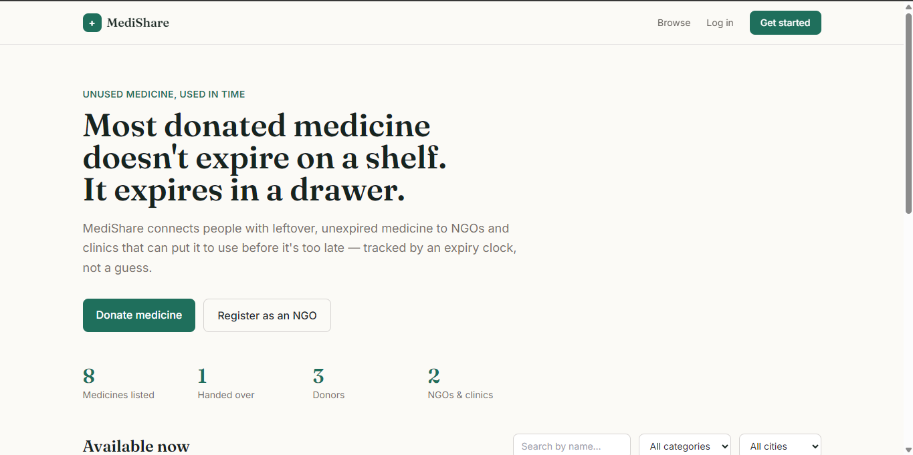
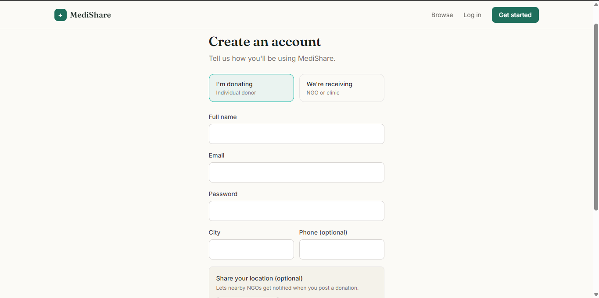
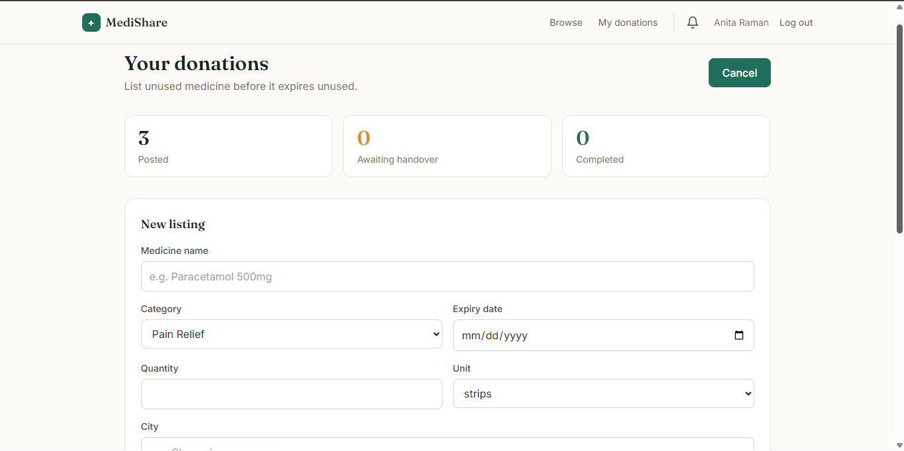
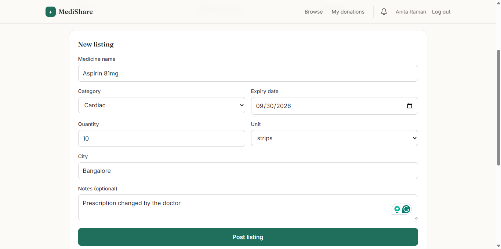
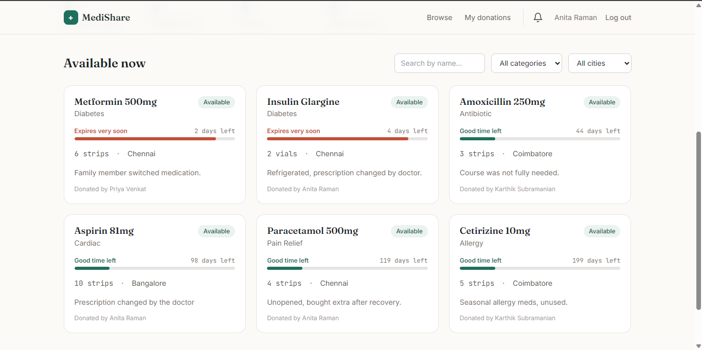
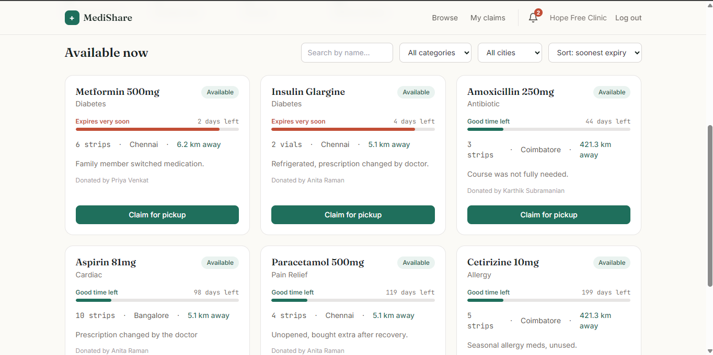
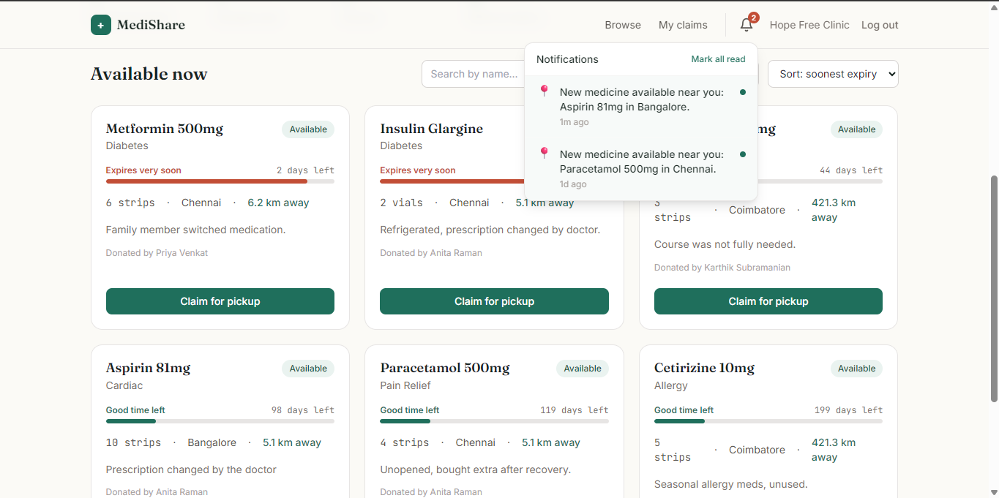
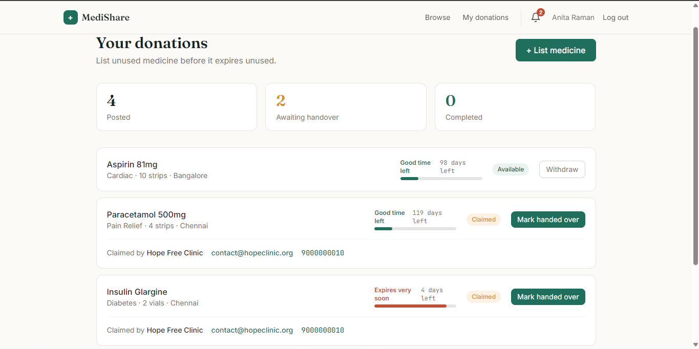
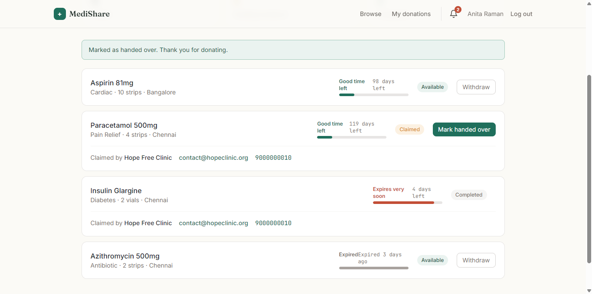
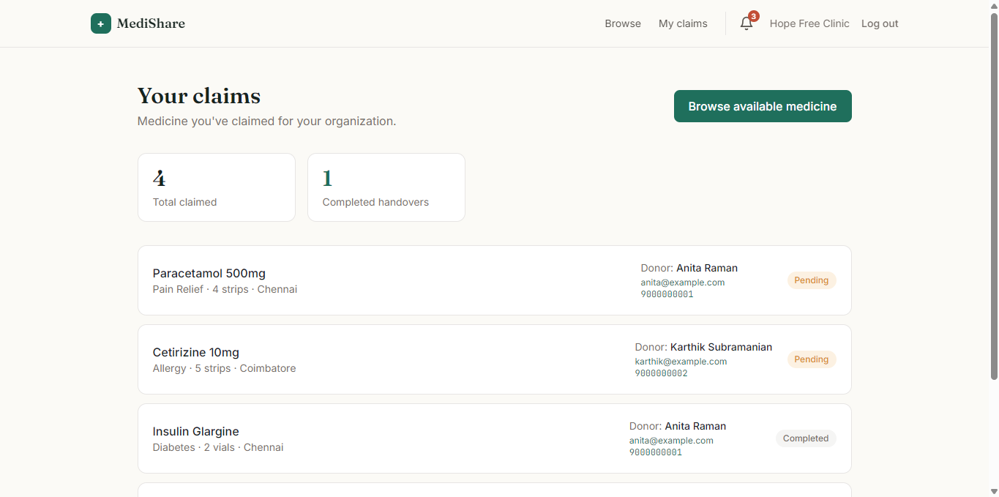

<div align="center">

# 💊 MediShare

**A platform that connects unused, unexpired medicine with the NGOs and clinics that can put it to use — before it's too late.**

[](https://nodejs.org)
[](https://react.dev)
[](#-running-the-tests)
[](#-license)

</div>

---

## The problem

Every year, a huge amount of partially-used or unopened medicine gets thrown away — courses changed by a doctor, prescriptions outlived, extra stock from a recovery. Meanwhile, NGOs and free clinics serving low-income patients often can't afford that same medicine. The gap usually isn't generosity — it's logistics. There's no simple way for a donor to say *"I have this, it's good until this date"* and have it reach someone who needs it **before that date passes**.

**MediShare** is built around that one constraint: time.

## ✨ Features

- 🩹 **Post & browse listings** — donors list unused medicine with quantity, category, and expiry date; NGOs browse and filter by city, category, and keyword
- ⏳ **Visual expiry urgency** — every listing shows a live "fresh → expiring soon → critical → expired" indicator, computed on every request, never stale
- 📍 **Location-aware matching** — NGOs can sort listings by real distance ("3.2 km away"), and nearby NGOs get notified automatically when a donor posts something close to them
- 🔔 **In-app notifications** — claim confirmations, handover confirmations, and nearby-listing alerts, with a live unread badge
- 🛠️ **Admin dashboard** — platform-wide oversight of users, listings, and claims, with moderation tools
- 📊 **Live impact stats** — medicines listed, handed over, donor/NGO counts
- 📜 **Self-documenting API** — full Swagger/OpenAPI docs at `/api/docs`

## 🖼️ Screenshots

| | |
|---|---|
| **Landing page** — the pitch, live stats, and browse feed | **Registration** — donor/NGO toggle, optional location sharing |
|  |  |
| **Donor dashboard** — posting and tracking listings | **New listing form** | 
|  |  |
| **Browse feed** — expiry urgency bars on every card | **Distance sorting** — "X km away," nearest-first |
|  |  |
| **Notifications** — live unread badge and dropdown | **Claimant contact info** — fixes the "reach out" gap |
|  |  |
| **Handover confirmed** — donor's view after completing | **NGO claim history** — with donor contact details |
|  |  |

## 🧱 Tech stack

| Layer | Stack |
|---|---|
| **Frontend** | React 18, Vite, React Router, Tailwind CSS, Axios |
| **Backend** | Node.js, Express, Drizzle ORM, SQLite (`node:sqlite`), JWT auth, Zod validation, bcrypt |
| **Testing** | Vitest, Supertest, React Testing Library — 63 tests |
| **Docs** | Swagger / OpenAPI |
| **Infra** | Docker, docker-compose, GitHub Actions CI |

## 🚀 Getting started

### Prerequisites
- [Node.js](https://nodejs.org) v22.5.0 or later (uses Node's built-in SQLite support)

### 1. Backend

```bash
cd server
npm install
npm run seed        # creates demo donor, NGO, and admin accounts with sample listings
npm start            # runs on http://localhost:4000
```

API docs live at **http://localhost:4000/api/docs** once the server is running.

### 2. Frontend

In a separate terminal:

```bash
cd client
npm install
npm run dev          # runs on http://localhost:5173
```

Open **http://localhost:5173** and log in with one of the seeded demo accounts (password `password123` for all):

| Role | Email |
|---|---|
| Donor | `anita@example.com` |
| NGO | `contact@hopeclinic.org` |
| Admin | `admin@example.com` |

### Running with Docker instead

```bash
docker compose up --build
docker compose exec server npm run seed   # first time only
```

## 🧪 Running the tests

```bash
cd server && npm test     # 54 tests — auth, listing lifecycle, role enforcement, geolocation, notifications, admin
cd client && npm test     # 9 tests — UI component behavior
```

CI runs both automatically on every push and pull request via GitHub Actions.

## 📁 Project structure

```
medicine-donation-platform/
├── .github/workflows/ci.yml     # CI pipeline
├── docker-compose.yml
├── server/
│   ├── app.js / server.js
│   ├── db/                      # Drizzle schema + database client
│   ├── routes/                  # auth, medicines, stats, notifications, admin
│   ├── validation/               # Zod request schemas
│   ├── utils/                    # distance calculation, notification triggers
│   ├── tests/
│   └── Dockerfile
└── client/
    └── src/
        ├── pages/                 # Landing, Login, Register, dashboards
        ├── components/            # Navbar, MedicineCard, ExpiryBar, NotificationBell...
        ├── context/               # AuthContext
        └── api/                   # Axios client
```

<details>
<summary><strong>🛠️ Notable engineering decisions (click to expand)</strong></summary>

<br>

**Why Drizzle ORM over Prisma, and `node:sqlite` over `better-sqlite3`.**
Prisma's query engine downloads a platform-specific binary at install time — a real dependency to manage. Drizzle's SQLite driver is pure JavaScript, wired to Node's own built-in `node:sqlite` module, so there's no native compilation step and no install-time network dependency. The tradeoff surfaced as a real bug during development: Drizzle's SQL compiler doesn't alias duplicate column names in joined queries (it expects positional row access), which silently mixed up data from two joined tables until fixed with `setReturnArrays(true)` on the underlying driver.

**Distance is computed in JavaScript, not SQL.**
SQLite has no built-in trigonometric functions, so rather than write an awkward raw-SQL Haversine expression, distance between a donor and an NGO is calculated in JS after fetching the (small, city-scoped) result set. Simpler and just as fast at this scale — the tradeoff would flip at a much larger scale, where you'd want it in the database or a dedicated geospatial index.

**Notifications are in-app (pull), not email/SMS (push).**
Real email/SMS delivery needs a third-party account (Twilio, SendGrid, etc.) with its own billing — a deliberate scope boundary, not a missing feature. The trigger logic (who gets notified, on what event) is fully built and isolated, so swapping the delivery mechanism later is a small change.

**Admin accounts aren't self-registrable.**
The public registration form only allows `donor` or `ngo` — admin accounts are created directly via the seed script, the same way most real systems handle elevated access.

**SQLite's `role` column has no `CHECK` constraint.**
SQLite can't alter a `CHECK` constraint in place without rebuilding the whole table. Rather than write a table-rebuild migration every time a role is added, role validity is enforced at the application layer (Zod, on every request) instead — a deliberate tradeoff between SQLite's limited DDL and an evolving schema.

</details>

## 🗺️ Roadmap

- [ ] Real email/SMS delivery for notifications
- [ ] Photo upload for medicine listings
- [ ] Donor/NGO ratings after a completed handover
- [ ] Refresh tokens (currently a single 7-day JWT)
- [ ] Let users update their saved location after registration

## 📄 License

This project is licensed under the [MIT License](LICENSE).

## 👤 Author

**Deepa**
[GitHub](https://github.com/deepa-raj) · [LinkedIn](https://linkedin.com/in/deepa-deepa) · [Portfolio](https://itsorbitorx.framer.website)
